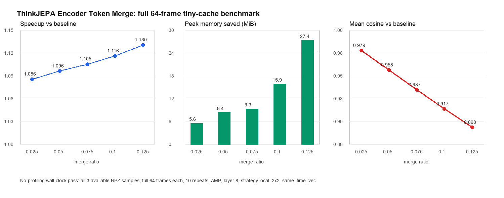

# ThinkJEPA Encoder-side Token Merge 完整测试报告

## 1. 一句话结论

这次不是 smoke test。最终速度结论来自当前远端可用的全部 `tiny-cache` 三个 NPZ 样本，每个样本完整使用 `64` 帧，并且对每个配置做多次 repeat 的完整 encoder forward。

结论是：**向量化后的 encoder-side token merge 在 ThinkJEPA dense V-JEPA encoder 上已经实现了真实 wall-clock 加速和 peak memory 下降**。在 layer 8 做一次 `local_2x2_same_time_vec` merge 时，`r=0.125` 将 dense video patch token 从 `8192 -> 7168`，encoder forward 从 `84.71 ms -> 74.93 ms`，约 `1.13x` 加速，peak memory 从 `2096.65 MiB -> 2069.28 MiB`，节省约 `27.37 MiB`。

但这还不是完整论文级结论：当前只有 tiny-cache 三个样本，下游训练也只有 `2 train / 1 test` 的小缓存闭环。它能证明链路成立、速度方向成立、memory 确实下降，但还需要更大 cache/更多任务来确认泛化和最终精度收益。



## 2. 这次到底把什么内容送进 token merge

这点很关键：**送进 token merge 的不是图片像素、不是 VLM 文本 token，也不是 NPZ 里已经缓存好的 `vjepa_feats`**。

实际输入链路是：

1. 从 `npz["imgs"]` 读取完整视频帧，shape 是 `[64, 256, 256, 3]`。
2. 做 ImageNet normalize 和视频 tensor 排列，进入在线 dense V-JEPA encoder，shape 变成 `[1, 3, 64, 256, 256]`。
3. V-JEPA patch embedding 使用 `tubelet_size=2` 和 `patch_size=16`：
   - 时间 token 数：`64 / 2 = 32`
   - 空间 patch grid：`256 / 16 = 16`, `256 / 16 = 16`
   - token 总数：`32 * 16 * 16 = 8192`
4. 每个 token 是一个 dense video patch token，hidden dim 是 `1024`，所以 merge 之前的 encoder hidden token 是 `[1, 8192, 1024]`。
5. 我们在 V-JEPA encoder 的第 `8` 个 transformer block 后，对这些 dense video patch token 做 training-free merge。

所以这次 merge 的对象可以准确表述为：

> ThinkJEPA 在线 dense V-JEPA encoder 中 layer 8 后的 video patch hidden tokens，shape 为 `[B, 8192, 1024]`。这些 token 来自当前 tiny-cache NPZ 的 `imgs` 完整 64 帧在线编码，不使用缓存的 `vjepa_feats`。

## 3. 方法：从旧 Python merge 到向量化 local 2x2 merge

旧版本 `local_2x2_same_time` 的逻辑是正确的，但实现方式是 Python 循环。它会逐 batch、逐 cell、逐 pair 计算相似度，再逐 token 更新 merge 状态。这个版本证明了“token 可合并”，但不是加速方法，因为 Python 循环开销极大。

这次新增的 `local_2x2_same_time_vec` 做的是同一个算法目标，但把核心 matching 改成 GPU tensor 操作：

1. 把 `[B, 8192, D]` reshape 成同一时间片内的 `2x2` 空间 cell。
2. 每个 cell 内有 4 个 patch token。
3. 每个 cell 只计算 6 对局部 token pair 的 cosine similarity，而不是全局 `N x N` attention。
4. 每个 cell 选最相似的一对 token。
5. 全局按照 similarity 排序，取 top-K 个 cell 执行 merge。
6. receiver 默认选择 feature norm 更大的 token，source token 按 token_size 加权平均进 receiver。
7. 删除 source token，得到压缩后的序列。
8. 如果 `restore_dense=True`，再用 `rep_for_orig` 把压缩序列恢复成下游仍能接受的 dense shape。

这不是 attention pruning，也没有引入全量注意力矩阵。它是 encoder hidden token 上的局部相似 token 合并。

## 4. 代码改动位置

主要修改三个文件：

- `vjepa2/src/models/utils/token_merge.py`
  - 新增 `local_2x2_same_time_vec`。
  - `restore_dense_tokens` 改成 batched `scatter_ + gather`。
  - 保留旧 Python strategy：`local_2x2_same_time` / `local_2x2_same_time_python`。
  - 对 vectorized strategy 加保护：当前只允许单层 merge，避免多层时静默 fallback 到 Python。

- `vjepa2/src/models/vision_transformer.py`
  - 在 encoder forward 里支持 token merge profile 字段。
  - 记录 `patch_embed / pre_merge_blocks / merge_module / post_merge_blocks / norm / restore_dense` 分段时间。

- `tools/run_encoder_token_merge_full_pipeline.py`
  - 支持完整 NPZ 集合 benchmark。
  - 默认关闭 segment profiling，保证主速度表是真实 wall-clock。
  - 单独用 `--profile_segments` 跑 profile pass。
  - summary 现在记录最终 merge layer 的 token 数、implementation、fallback 状态。

## 5. 完整测试设置

远端路径：

- 项目：`/root/autodl-tmp/thinkjepa-work/ThinkJEPA`
- 数据：`/root/autodl-tmp/thinkjepa-work/tiny-cache/part2`
- 输出：`/root/autodl-tmp/thinkjepa-work/ThinkJEPA/outputs/token_merge_speedup_20260525`

可用 NPZ 只有 3 个，所以完整测试定义为：**当前远端可用 tiny-cache 全部 3 个 NPZ 样本，每个样本完整 64 帧**。

三个样本：

| sample | source video path in metadata | npz shape |
|---|---|---|
| chair `1873` | `/u/yli8/data/egodex/part2/assemble_disassemble_furniture_bench_chair/1873.mp4` | `imgs [64,256,256,3]` |
| drawer `5522` | `/u/yli8/data/egodex/part2/assemble_disassemble_furniture_bench_drawer/5522.mp4` | `imgs [64,256,256,3]` |
| cabinet `542` | `/u/yli8/data/egodex/part2/insert_remove_furniture_bench_cabinet/542.mp4` | `imgs [64,256,256,3]` |

主速度测试命令使用：

```bash
python tools/run_encoder_token_merge_full_pipeline.py \
  --npz_glob "/root/autodl-tmp/thinkjepa-work/tiny-cache/part2/**/*.npz" \
  --out_dir outputs/token_merge_speedup_20260525/encoder_vec_l8_full64_noprofile \
  --img_size 256 \
  --max_frames 0 \
  --merge_layers 8 \
  --merge_ratios 0.025,0.05,0.075,0.10,0.125 \
  --strategy local_2x2_same_time_vec \
  --receiver max_norm \
  --repeats 10 \
  --warmup 3 \
  --amp \
  --no_profile_segments
```

注意：`--max_frames 0` 表示不截断，使用 NPZ 里的完整 64 帧。

## 6. Encoder 完整速度与显存结果

主表来自 no-profiling wall-clock pass。这里的 `latency_ms` 是整个 dense V-JEPA encoder forward 的 wall-clock 时间，不是训练全流程时间，也不是单个 merge kernel 时间。

| merge ratio | tokens before -> after | removed | latency mean | speedup | peak memory | memory saved | mean cosine | relative L2 |
|---:|---:|---:|---:|---:|---:|---:|---:|---:|
| baseline | `8192 -> 8192` | 0 | `84.71 ms` | `1.000x` | `2096.65 MiB` | `0.00 MiB` | `1.0000` | `0.0000` |
| 0.025 | `8192 -> 7988` | 204 | `78.04 ms` | `1.086x` | `2091.10 MiB` | `5.55 MiB` | `0.9785` | `0.2083` |
| 0.050 | `8192 -> 7783` | 409 | `77.27 ms` | `1.096x` | `2088.24 MiB` | `8.41 MiB` | `0.9582` | `0.2912` |
| 0.075 | `8192 -> 7578` | 614 | `76.64 ms` | `1.105x` | `2087.33 MiB` | `9.32 MiB` | `0.9373` | `0.3568` |
| 0.100 | `8192 -> 7373` | 819 | `75.89 ms` | `1.116x` | `2080.79 MiB` | `15.86 MiB` | `0.9172` | `0.4101` |
| 0.125 | `8192 -> 7168` | 1024 | `74.93 ms` | `1.130x` | `2069.28 MiB` | `27.37 MiB` | `0.8978` | `0.4556` |

解释：

- `r=0.05` 是更保守点：速度约 `1.10x`，cosine 还在 `0.9582`。
- `r=0.125` 是更激进点：速度约 `1.13x`，显存节省最大，但 feature fidelity 明显下降到 `0.8978`。
- 所有 vectorized 结果里 `any_fallback=false`，`final_implementation=["vectorized"]`，说明这次没有偷偷退回旧 Python path。

## 7. 分段 profile：速度从哪里来

分段 profile 单独跑，不和主速度表混在一起。原因是 profile 内部会在 CUDA 边界做同步，如果直接用于主 latency，会污染真实推理时间。

| config | patch embed | pre-merge blocks | merge module | post-merge blocks | norm | restore dense | profiled total |
|---|---:|---:|---:|---:|---:|---:|---:|
| baseline | `0.83 ms` | `84.13 ms` | `0.00 ms` | `0.00 ms` | `0.13 ms` | `0.00 ms` | `85.11 ms` |
| r=0.05 | `0.83 ms` | `32.51 ms` | `0.93 ms` | `43.06 ms` | `0.05 ms` | `0.07 ms` | `77.53 ms` |
| r=0.125 | `0.90 ms` | `32.55 ms` | `0.95 ms` | `40.57 ms` | `0.05 ms` | `0.07 ms` | `75.18 ms` |

这个表说明：

- merge 本身已经从旧 Python 的几百毫秒降到约 `0.95 ms`。
- 真正省时间的是 layer 8 后面的 transformer block 处理更短 token sequence。
- `restore_dense` 有开销，但只有约 `0.07 ms`，不再是主要瓶颈。

## 8. 旧 Python 对照

同样是当前可用全部 3 个 NPZ、完整 64 帧，旧 Python strategy 在 `r=0.125` 的结果是：

| strategy | ratio | latency mean | merge module mean | result |
|---|---:|---:|---:|---|
| baseline | 0 | `84.65 ms` | `0.00 ms` | 正常 encoder |
| `local_2x2_same_time_python` | 0.125 | `819.95 ms` | `765.83 ms` | 极慢 |
| `local_2x2_same_time_vec` | 0.125 | `74.93 ms` | `~0.95 ms` | 真实加速 |

这解释了之前为什么“token 数下降但时间没加速”：当时慢的是 Python local matching / gather / scatter / restore 这些动态操作，不是 token merge 这个思想本身。向量化以后，merge 开销降下来，后续 transformer block 的 token 减少才真正体现为 wall-clock 加速。

## 9. Downstream 完整训练/测试闭环

下游不是单步 smoke，而是使用固定 manifest：

- train: `train_tiny.txt`，2 个样本
- test: `test_tiny.txt`，1 个样本
- epochs: `5`
- `FORCE_ONLINE_VJEPA=1`，强制从 `npz["imgs"]` 在线跑 dense encoder
- `trajmode=track`

| config | best epoch | best val ADE | best val loss | best val pred loss | best latent cosine distance |
|---|---:|---:|---:|---:|---:|
| baseline | 5 | `1.1757` | `0.5353` | `9.6363` | `0.6413` |
| r=0.05 vec | 5 | `1.2178` | `0.5734` | `9.6381` | `0.6408` |
| r=0.125 vec | 5 | `1.2307` | `0.5906` | `9.6381` | `0.6393` |

下游解释：

- tiny-cache 下，token merge 后 trajectory ADE 比 baseline 略差。
- `r=0.05` 的 ADE 增加约 `0.0422`，`r=0.125` 增加约 `0.0550`。
- latent prediction loss 很接近，说明 predictor 仍能正常工作。
- 因为 test set 只有 1 个样本，这个下游精度差异只能看作 sanity/full-pipeline compatibility evidence，不适合当大规模结论。

## 10. 最终判断

这次优化已经把 encoder-side token merge 从“研究原型但不加速”推进到“在完整 encoder pipeline 上真实加速和降显存”：

- token sequence 真实减少：`8192 -> 7168`。
- no-profiling wall-clock 真实下降：`84.71 ms -> 74.93 ms`。
- peak memory 真实下降：`2096.65 MiB -> 2069.28 MiB`。
- 旧 Python 瓶颈被消除：`819.95 ms -> 74.93 ms`。
- downstream 训练/测试可跑通，shape 和任务链路没有断。

推荐下一步：

- 把 `r=0.05` 作为保守默认候选，因为 fidelity 更高。
- 把 `r=0.125` 作为速度/显存更激进候选。
- 后续需要更大 cache 和更多 test 样本确认精度稳定性。
- 若继续提速，可以尝试更早层 merge、layer sweep、CUDA event profile、以及不需要 `restore_dense` 的 predictor-side 接口改造。

## 11. 本轮验证清单

- `python -m py_compile`：通过。
- synthetic vectorized merge：通过，`[2,128,32] -> [2,112,32] -> restore [2,128,32]`。
- multi-layer vectorized guard：通过，多层配置会显式报错，不再静默 fallback。
- full encoder benchmark：通过，3 个 NPZ 全部 64 帧。
- no-profiling wall-clock pass：通过，作为主速度结论来源。
- profile segments pass：通过，只用于解释速度来源。
- old Python strategy full comparison：通过。
- downstream baseline 5 epoch：通过。
- downstream r=0.05 5 epoch：通过。
- downstream r=0.125 5 epoch：通过。
